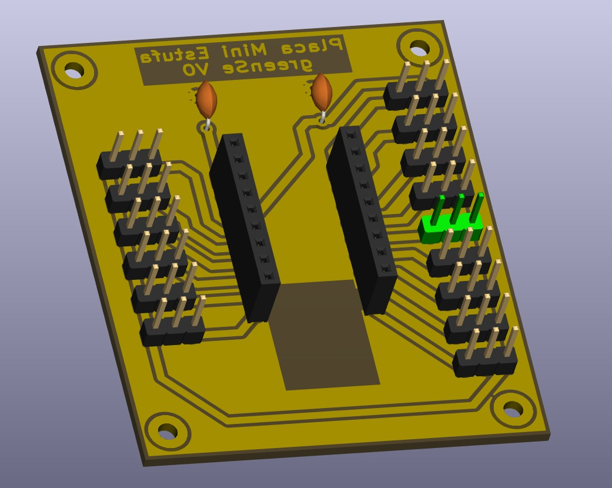
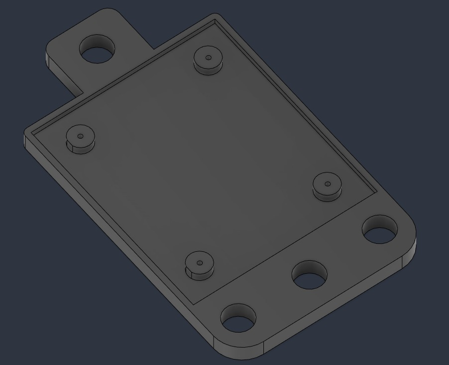
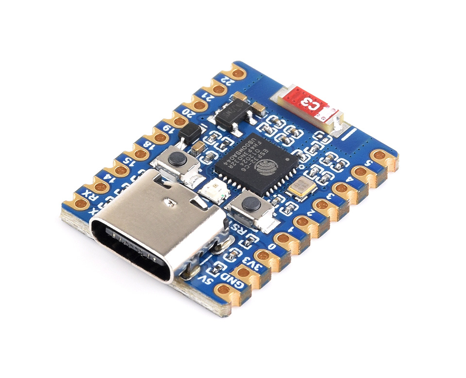
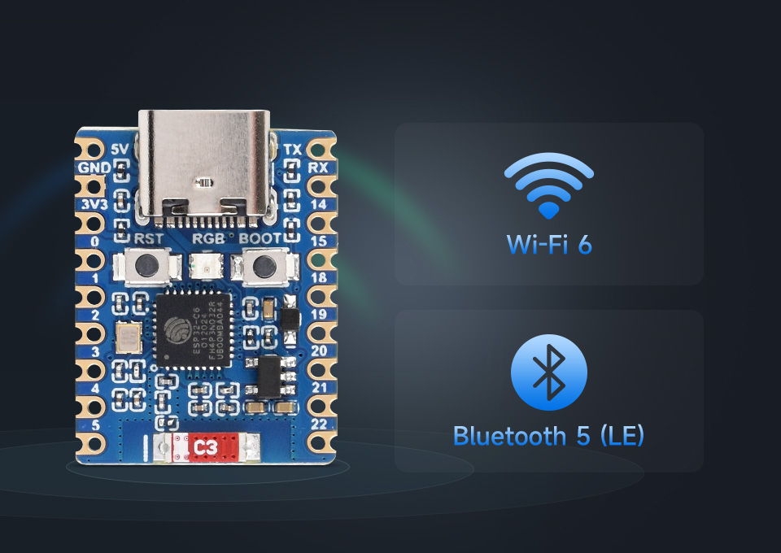

# N01 · Estufa Germinar

Um nó de germinação que cabe na bancada: a placa que recebe o ESP32-C6 e os sensores, a base impressa em 3D que a sustenta na estufa, e o firmware que publica o clima no GreenSe.

O desenho está aberto. Dá para fabricar a placa, imprimir a base e gravar o mesmo firmware que roda em campo.

---

## Três camadas

| Camada | O que é | Onde está |
|--------|---------|-----------|
| Placa | PCB da Mini Estufa, soquete do ESP32-C6 e conectores dos sensores | [`PlacaMiniEstufa/`](PlacaMiniEstufa/) |
| Base 3D | Suporte com furos de fixação e ressaltos para a placa | [`imagens/base3D.stl`](imagens/base3D.stl) |
| Firmware | ESP-IDF 5.2 para ESP32-C6, leitura e MQTT | [`main/`](main/) |

### Placa



A **Placa Mini Estufa V0** é o carrier do ESP32-C6. Dois conectores no centro recebem a placa do módulo. Nas bordas ficam os pinos de alimentação e de sinal, com furos nos cantos para parafusar na base. O projeto KiCad (esquema e PCB) está em [`PlacaMiniEstufa/`](PlacaMiniEstufa/).

### Base 3D



A base acompanha o contorno da placa. Quatro ressaltos apoiam o PCB, e as abas laterais servem para prender o conjunto na estrutura da estufa.

Para imprimir, abra [`imagens/base3D.stl`](imagens/base3D.stl) no fatiador. O arquivo está em milímetros.

### Firmware





O firmware lê o ar, o solo e a luz, e publica tudo a cada 5 segundos em `estufa/germinar`. O LED da própria placa mostra se o Wi-Fi e o MQTT estão ativos.

- **Módulo:** ESP32-C6 com USB-C, Wi-Fi 6 e Bluetooth 5 LE
- **Chip testado:** ESP32-C6FH8, flash de 8 MB; a imagem usa 4 MB
- **LED:** GPIO 8, ordem de cor RGB
- **Porta serial:** `/dev/ttyACM0`

---

## Como reproduzir

1. Imprima [`imagens/base3D.stl`](imagens/base3D.stl).
2. Fabrique a placa a partir de [`PlacaMiniEstufa/`](PlacaMiniEstufa/) e encaixe o ESP32-C6 nos conectores centrais.
3. Ligue os sensores nos pinos da tabela abaixo. Alimente tudo em **3,3 V**. O resistor de pull-up do DHT11 e o do DS18B20 ficam entre o fio de dados e o 3,3 V, nunca no 5 V.
4. Parafuse a placa nos ressaltos da base.
5. Grave o firmware:

```bash
cd client/N01_Estufa_Germinar
. $HOME/esp/esp-idf/export.sh
idf.py set-target esp32c6
idf.py build
idf.py -p /dev/ttyACM0 flash monitor
```

Para sair do monitor: `Ctrl+]`.

No log, a sequência esperada é NVS, Wi-Fi, MQTT e uma publicação a cada 5 segundos.

---

## Sensores

| Função | Sensor | Pino | Ligação |
|--------|--------|------|---------|
| Temperatura e umidade do ar | DHT11 | GPIO 18 | Dados com pull-up de 4,7 kΩ para 3,3 V |
| Temperatura do solo | DS18B20 | GPIO 19 | Amarelo no GPIO 19, vermelho em 3,3 V, preto no GND, pull-up entre dados e 3,3 V |
| Luminosidade | HW-072, saída DO | GPIO 20 | Nível baixo = claro |
| Umidade do solo | HD-38, saída AO | GPIO 0 (A0) | Analógico |
| Status | LED da placa | GPIO 8 | Azul ligado, vermelho sem Wi-Fi ou MQTT |

Os GPIOs 12 e 13 são o USB. O GPIO 9 é pino de boot. Nenhum dos dois entra na fiação dos sensores.

| Cor do LED | Estado |
|------------|--------|
| Azul | Wi-Fi conectado e publicando |
| Vermelho | Wi-Fi ou MQTT desconectado |

---

## MQTT

- **Broker:** `wss://mqtt.greense.com.br`
- **Cliente:** `Estufa_Germinar`
- **Tópico:** `estufa/germinar`
- **Certificado:** `main/certs/greense_cert.pem`

```json
{
  "temp": 28.50,
  "umid": 53.10,
  "co2": 0.00,
  "luz": 0.00,
  "agua_min": 0,
  "agua_max": 0,
  "temp_reserv_int": 26.44,
  "ph": 0.00,
  "ec": 0.00,
  "temp_reserv_ext": 0.00,
  "umid_solo_raw": 3267,
  "umid_solo_pct": 26.65
}
```

| Campo | Origem |
|-------|--------|
| `temp`, `umid` | DHT11, em °C e % |
| `luz` | HW-072. 1 = claro, 0 = escuro |
| `temp_reserv_int` | DS18B20, em °C. `-127` significa sensor ausente |
| `umid_solo_raw`, `umid_solo_pct` | HD-38 |
| `co2`, `ph`, `ec`, `agua_min`, `agua_max`, `temp_reserv_ext` | Reservados, publicados em 0 |

---

## Credenciais

Crie `main/secrets.h`. Esse arquivo não entra no Git.

```c
#ifndef SECRETS_H
#define SECRETS_H

#define WIFI_SSID "sua_rede_wifi"
#define WIFI_PASS "sua_senha_wifi"

#endif
```

Pinos, tópico e identificador do cliente ficam em `main/config.h`.

---

## O que há no repositório

```
N01_Estufa_Germinar/
├── imagens/
│   ├── placaPCB.jpeg           # Render da placa
│   ├── base3D.jpeg             # Render da base
│   ├── base3D.stl              # Malha para impressão
│   ├── esp32c6.jpg
│   └── esp32c6_pinos.jpg
├── PlacaMiniEstufa/            # KiCad: esquema, PCB e datasheets
├── main/
│   ├── main.c
│   ├── config.h
│   ├── secrets.h
│   ├── conexoes/
│   ├── sensores/
│   ├── atuadores/
│   └── certs/greense_cert.pem
├── sdkconfig
└── sdkconfig.defaults
```

Para compilar: ESP-IDF 5.2 (testado em 5.2.2), Python 3, alvo `esp32c6`. Componentes: `esp_wifi`, `esp_event`, `mqtt`, `nvs_flash`, `driver`, `esp_adc`, `esp_timer` e `espressif/led_strip`.

---

## Licença

Este projeto faz parte do Projeto GreenSe da Universidade de Brasília.

**Autoria**: Prof. Marcelino Monteiro de Andrade  
**Instituição**: Faculdade de Ciências e Tecnologias em Engenharia (FCTE) – Universidade de Brasília  
**Email**: [andrade@unb.br](mailto:andrade@unb.br)  
**Website**: [https://greense.com.br](https://greense.com.br)
