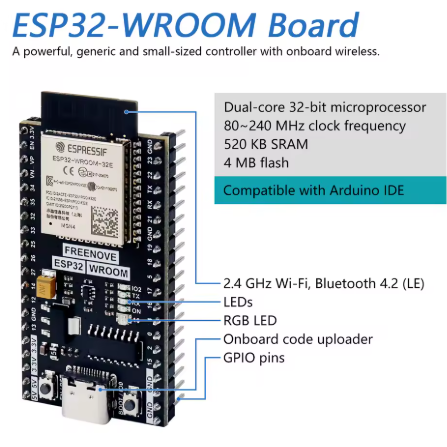

# 🌿 Projeto GreenSe – Nó de Monitoramento Ambiental e Atuação (ESP32)

Firmware baseado em **ESP-IDF (v5.x)** para monitoramento e controle ambiental, integrando sensores múltiplos (AHT20, ENS160, DHT, DS18B20) e atuadores, com comunicação segura via **MQTT** e suporte a interface web local.


---

## ⚙️ Visão Geral

Este projeto implementa um nó IoT completo para **agricultura inteligente**, capaz de coletar dados ambientais, acionar dispositivos e enviar informações a um servidor remoto.

Suporta operação em modo **Access Point (AP)** e integração via **MQTT sobre TLS** com broker seguro.

### Principais recursos

- 📡 Conexão Wi-Fi configurável (modo AP ou STA).
- 🔐 Comunicação **MQTT segura (TLS)** usando `greense_cert.pem`.
- 🌤️ Sensores integrados:
  - AHT20 / DHT22 – temperatura e umidade do ar.
  - ENS160 – qualidade do ar (TVOC e eCO₂).
  - DS18B20 – temperatura do solo.
- ⚙️ Atuadores controláveis remotamente (revezes, LEDs, bombas, etc.).
- 💾 Armazenamento local (SPIFFS/NVS) para logs e parâmetros.
- 🌐 Servidor HTTP embarcado para visualização local.
- 🧠 Modularidade em “componentes” independentes: conexões, sensores e atuadores.

---

## 🧩 Estrutura de Diretórios

```
main/
├── main.c                      # Inicialização e loop principal
├── conexoes/
│   ├── conexoes.c/.h           # Configuração de Wi-Fi e MQTT
│
├── sensores/
│   ├── sensores.c/.h           # Integração geral dos sensores
│   ├── aht20.c/.h              # Sensor de temperatura e umidade
│   ├── ens160.c/.h             # Sensor de qualidade do ar
│   ├── ds18b20.c/.h            # Sensor de temperatura do solo
│   ├── dht.c/.h                # Alternativa de leitura DHT22
│
├── atuadores/
│   ├── atuadores.c/.h          # Controle de relés e saídas digitais
│
├── certs/
│   └── greense_cert.pem        # Certificado para MQTT seguro (TLS)
│
├── CMakeLists.txt              # Configuração de build e dependências
└── README.md                   # Este arquivo
```

---

## 📡 Comunicação MQTT

- **Broker:** `mqtt.greense.com.br`
- **Porta:** `8883` (TLS)
- **Biblioteca:** `esp-mqtt`
- **Certificado:** incluído via `certs/greense_cert.pem`

### Tópicos padrão

| Tópico | Direção | Descrição |
|--------|----------|-----------|
| `greense/sensores` | → broker | Publicação de dados ambientais |
| `greense/atuadores` | ← broker | Comandos de controle |
| `greense/status` | → broker | Mensagens de status e heartbeat |

---

## 🌐 Servidor Web Local

Permite visualização rápida de medições e acionamento manual dos atuadores.  
Acesso via `http://192.168.4.1/` (modo AP) ou endereço IP obtido no modo STA.

---

## 🖼️ Hardware de Referência

| Sensor MLX90640 |
|-----------------|
|  |

## 💾 Requisitos de Build

### Ferramentas

- **ESP-IDF ≥ 5.0**
- **Python 3.x**
- `idf.py`, `esptool.py`, `menuconfig`

### Componentes utilizados

- `esp_wifi`, `esp_event`, `mqtt`, `nvs_flash`
- `driver`, `led_strip`, `spiffs`, `vfs`, `lwip`

---

## 🚀 Como Executar

1. Configure o ambiente e o alvo:
   ```bash
   idf.py set-target esp32
   idf.py menuconfig
   ```
2. Compile e grave:
   ```bash
   idf.py build flash monitor
   ```
3. Conecte-se à rede ou broker configurado.
4. Observe logs de inicialização, conexão e publicação MQTT.

---

## 🧪 Testes de Campo

- Testado em **ESP32-WROOM-32** e **ESP32-S3**.
- Comunicação validada com **Mosquitto** e **Flask MQTT Server**.
- Operação estável em Wi-Fi 2.4 GHz e TLS ativo.

---

## 🧰 Próximas Extensões

- Suporte a OTA (atualização remota).
- Integração com banco de dados InfluxDB.
- Interface web responsiva em React/PWA.
- Controle inteligente por IA embarcada.

---

## 🧑‍🔬 Autoria e Créditos

**Projeto GreenSe | Agricultura Inteligente**  
Coordenação: *Prof. Marcelino Monteiro de Andrade* e *Prof. Ronne Toledo*  
Faculdade de Ciências e Tecnologias em Engenharia (FCTE) – Universidade de Brasília  
📧 [andrade@unb.br](mailto:andrade@unb.br)  
🌐 [https://greense.com.br](https://greense.com.br)
