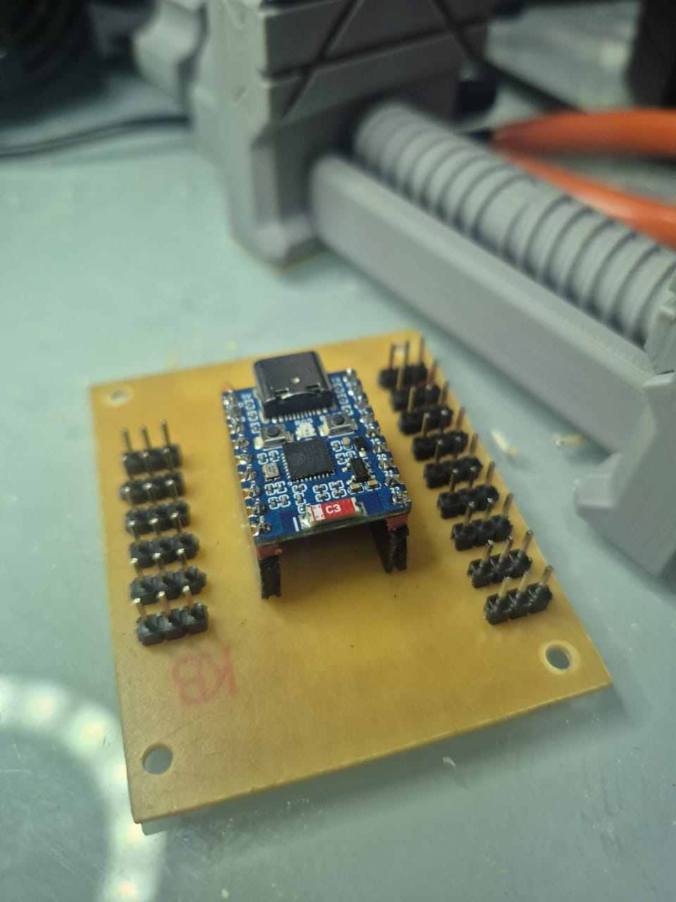
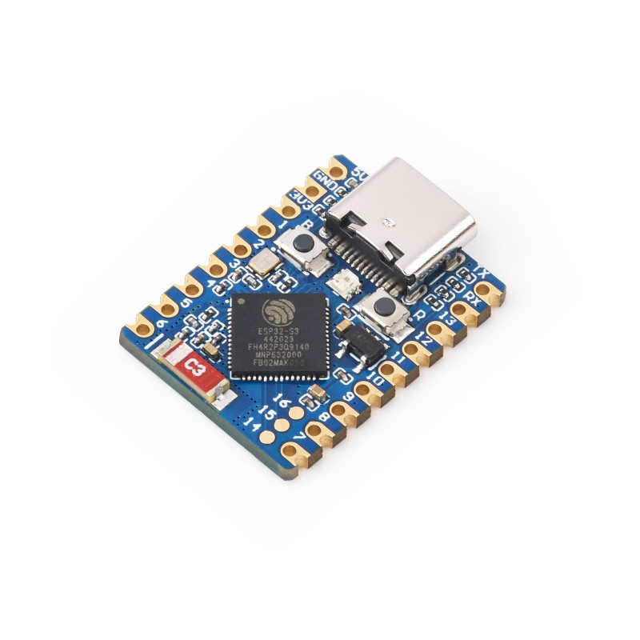
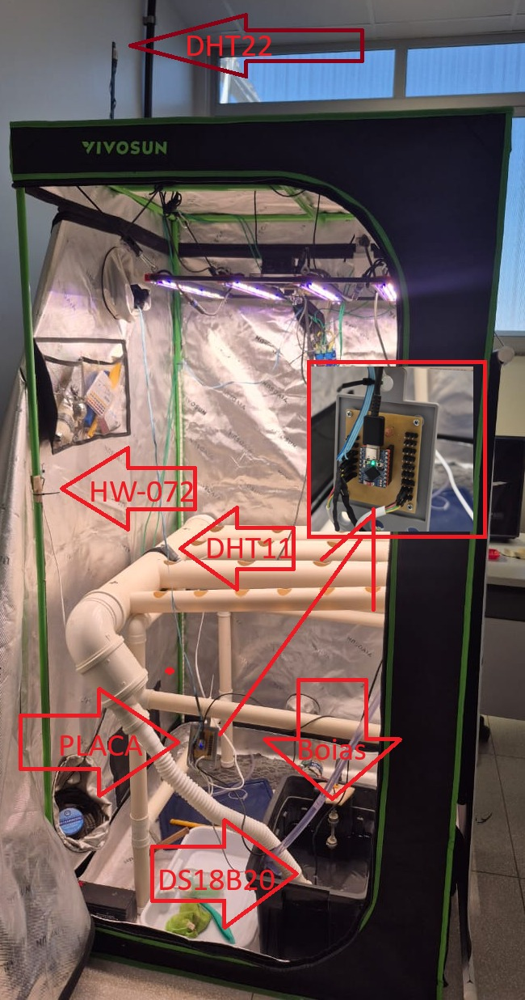

# N02 · Estufa Maturar

A maturação usa a mesma Placa Mini Estufa e a mesma base impressa da germinação. O que muda é o módulo no soquete, um ESP32-S3 Zero, e dois grupos de sensores que a germinação não lê: o DHT22 do lado de fora e as boias do reservatório.

O desenho da placa e da base está na N01. Esta pasta guarda o firmware deste nó.

---

## Três camadas

| Camada | O que é | Onde está |
|--------|---------|-----------|
| Placa | A mesma PCB da Mini Estufa, com o ESP32-S3 Zero no soquete | [`../N01_Estufa_Germinar/PlacaMiniEstufa/`](../N01_Estufa_Germinar/PlacaMiniEstufa/) |
| Base 3D | O mesmo suporte da N01 | [`../N01_Estufa_Germinar/imagens/base3D.stl`](../N01_Estufa_Germinar/imagens/base3D.stl) |
| Firmware | ESP-IDF 5.2 para ESP32-S3. A leitura e o MQTT ficam em [`../greense/`](../greense/) | [`main/`](main/) |

### Placa




A placa é a da germinação. O KiCad (esquema e PCB) continua em [`../N01_Estufa_Germinar/PlacaMiniEstufa/`](../N01_Estufa_Germinar/PlacaMiniEstufa/). No centro entra o ESP32-S3 Zero no lugar do ESP32-C6.

### Base 3D


A base é a mesma da N01. Para imprimir, abra [`../N01_Estufa_Germinar/imagens/base3D.stl`](../N01_Estufa_Germinar/imagens/base3D.stl) no fatiador. O arquivo está em milímetros.

### Firmware



O firmware lê o ar de dentro, o ar de fora, o solo, a luz e as boias, e publica tudo a cada 5 segundos em `estufa/maturar`. O código dessa leitura é o mesmo da N01 e mora em [`../greense/`](../greense/). Aqui, `main/config.h` define o tópico `estufa/maturar`, liga as boias e o DHT22, e publica `temp_externa` e `umid_externa` como inteiros. Os pinos seguem o alvo desta pasta, que já é `esp32s3`.

- **Módulo:** Waveshare ESP32-S3 Zero, USB-C, Wi-Fi e Bluetooth 5 LE
- **Chip:** ESP32-S3FH4R2, flash de 4 MB e PSRAM de 2 MB
- **LED:** WS2812 no GPIO21, ordem de cor RGB
- **Porta serial:** `/dev/ttyACM0`

---

## Na estufa



A placa fica na parede da tenda, sobre a base impressa. O DHT11 mede o ar de dentro. O DHT22 fica acima da tenda e mede o ar de fora. O HW-072 olha para a luz. O HD-38 entra no substrato. A sonda do DS18B20 mede a temperatura junto ao cultivo. As boias ficam no reservatório.

---

## Como reproduzir

1. Imprima [`../N01_Estufa_Germinar/imagens/base3D.stl`](../N01_Estufa_Germinar/imagens/base3D.stl).
2. Fabrique a placa a partir de [`../N01_Estufa_Germinar/PlacaMiniEstufa/`](../N01_Estufa_Germinar/PlacaMiniEstufa/) e encaixe o ESP32-S3 Zero nos conectores centrais.
3. Ligue os sensores nos pinos da tabela abaixo. Alimente tudo em **3,3 V**. O resistor de pull-up do DHT11, do DHT22 e do DS18B20 fica entre o fio de dados e o 3,3 V.
4. Parafuse a placa nos ressaltos da base.
5. Grave o firmware:

```bash
cd client/N02_Estufa_Maturar
. $HOME/esp/esp-idf/export.sh
idf.py -p /dev/ttyACM0 build flash monitor
```

O alvo `esp32s3` já está no `sdkconfig`. `idf.py set-target esp32s3` só entra se essa pasta for recriada. Se a gravação não começar, segure BOOT, aperte RESET e solte BOOT.

Para sair do monitor: `Ctrl+]`.

No log, a sequência esperada é NVS, Wi-Fi, MQTT e uma publicação a cada 5 segundos.

---

## Sensores

| Função | Sensor | GPIO | Ligação |
|--------|--------|------|---------|
| Temperatura e umidade do ar | DHT11 | GPIO4 | Dados com pull-up de 4,7 kΩ para 3,3 V |
| Temperatura e umidade externas | DHT22 | GPIO3 | Dados com pull-up de 4,7 kΩ para 3,3 V. O GPIO3 é pino de boot: o pull-up deixa a linha em alto |
| Temperatura do solo | DS18B20 | GPIO5 | Dados com pull-up para 3,3 V |
| Luminosidade | HW-072, saída DO | GPIO6 | Nível baixo = claro |
| Umidade do solo | HD-38, saída AO | GPIO1 | Analógico, ADC1 canal 0 |
| Boia baixa | contato para GND | GPIO7 | Aberto = 1, fechado = 0. Campo `agua_min` |
| Boia alta | contato para GND | GPIO8 | Aberto = 1, fechado = 0. Campo `agua_max` |
| Status | LED da placa | GPIO21 | Azul publicando, vermelho sem Wi-Fi ou MQTT |

O GPIO0 é o botão BOOT. O GPIO19 e o GPIO20 são o USB. O GPIO43 e o GPIO44 são o UART de log. Nenhum desses entra na fiação dos sensores.

| Cor do LED | Estado |
|------------|--------|
| Azul | Wi-Fi conectado e publicando |
| Vermelho | Wi-Fi ou MQTT desconectado |

---

## MQTT

- **Broker:** `wss://mqtt.greense.com.br`
- **Cliente:** `Estufa_Maturar`
- **Tópico:** `estufa/maturar`
- **Certificado:** [`../greense/certs/greense_cert.pem`](../greense/certs/greense_cert.pem)

`temp_externa` e `umid_externa` saem sem casa decimal, porque o Influx desta estufa guarda esses campos como inteiro.

```json
{
  "temp": 28.50,
  "umid": 53.10,
  "co2": 0.00,
  "luz": 1.00,
  "agua_min": 1,
  "agua_max": 0,
  "temp_reserv_int": 26.44,
  "ph": 0.00,
  "ec": 0.00,
  "temp_reserv_ext": 0.00,
  "temp_externa": 27,
  "umid_externa": 61,
  "umid_solo_raw": 3267,
  "umid_solo_pct": 26.65
}
```

| Campo | Origem |
|-------|--------|
| `temp`, `umid` | DHT11, em °C e % |
| `luz` | HW-072. 1 = claro, 0 = escuro |
| `agua_min`, `agua_max` | Boias. 1 = contato aberto, 0 = fechado em GND |
| `temp_reserv_int` | DS18B20, em °C. `-127` significa sensor ausente |
| `umid_solo_raw`, `umid_solo_pct` | HD-38. A calibração fica em `main/config.h` |
| `temp_externa`, `umid_externa` | DHT22 na GPIO3, em °C e %, arredondados |
| `co2`, `ph`, `ec`, `temp_reserv_ext` | Reservados, publicados em 0 |

---

## Credenciais

Crie `main/secrets.h`. Esse arquivo não entra no Git.

```c
#ifndef SECRETS_H
#define SECRETS_H

#define WIFI_SSID "sua_rede_wifi"
#define WIFI_PASS "sua_senha_wifi"

#endif
```

O tópico e o identificador do cliente ficam em `main/config.h`. Os pinos ficam em `client/greense/` e seguem o alvo desta pasta, que já é `esp32s3`.

---

## O que há no repositório

```
N02_Estufa_Maturar/
├── imagens/
│   ├── esp32s3.jpg             # ESP32-S3 Zero
│   └── estufaMaturar.jpeg      # Estufa instrumentada
├── main/
│   ├── main.c                  # Chama a biblioteca greense
│   ├── config.h                # Tópico, calibração, boias e DHT22 ligados
│   └── secrets.h
├── sdkconfig                   # Alvo esp32s3
└── sdkconfig.defaults
```

A placa e a base 3D estão em [`../N01_Estufa_Germinar/`](../N01_Estufa_Germinar/). O código comum está em [`../greense/`](../greense/). Para compilar: ESP-IDF 5.2, Python 3, alvo `esp32s3`.

---

## Licença

Este projeto faz parte do Projeto GreenSe da Universidade de Brasília.

**Autoria**: Prof. Marcelino Monteiro de Andrade  
**Instituição**: Faculdade de Ciências e Tecnologias em Engenharia (FCTE) – Universidade de Brasília  
**Email**: [andrade@unb.br](mailto:andrade@unb.br)  
**Website**: [https://greense.com.br](https://greense.com.br)
