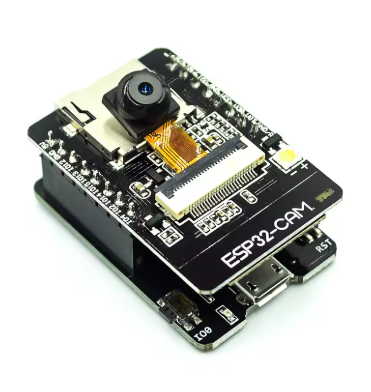

# 📸 Módulo ESP32-CAM – Captura e Envio de Imagens via HTTPS

Firmware desenvolvido em **ESP-IDF (v5.x)** para o módulo **ESP32-CAM**, responsável por capturar imagens e enviá-las de forma segura via **HTTPS POST** para um servidor remoto (ex: Raspberry Pi ou Flask API).


---

## ⚙️ Visão Geral

O projeto implementa uma **câmera IoT autônoma**, capaz de capturar imagens JPEG, armazenar em cartão SD (opcional) e enviar para um endpoint HTTPS com autenticação via certificado.

### Principais Recursos

- 📸 Captura de imagem via **esp32-camera**  
- 🔐 Envio seguro via **HTTPS POST**  
- 💾 Armazenamento local opcional em SD (FATFS)  
- 🌐 Conexão Wi-Fi automática (STA mode)  
- 📡 Comunicação com servidor Flask ou Raspberry Pi  
- 🔁 Reenvio automático em caso de falha de conexão  

---

## 🧩 Estrutura de Diretórios

```
main/
│
├── main.c                      # Função principal (setup e loop de captura/envio)
│
├── certs/
│   └── greense_cert.pem        # Certificado HTTPS embutido no firmware
│
└── CMakeLists.txt              # Configuração do build e dependências
```

---

## 🖼️ Hardware de Referência

| ESP32-CAM|
|-----------------|
|  |

## 🧱 Dependências ESP-IDF

Declaradas em `CMakeLists.txt`:

| Categoria         | Componentes |
|-------------------|-------------|
| Conectividade     | `esp_wifi`, `esp_http_client`, `nvs_flash` |
| Câmera            | `esp32-camera`, `driver` |
| Armazenamento     | `fatfs`, `sdmmc` |
| Servidor HTTPS    | `esp_http_server` |

---

## 📸 Fluxo de Operação

1. Inicializa **NVS**, **Wi-Fi** e **câmera**.  
2. Captura frame JPEG (QVGA ou VGA).  
3. Monta corpo de requisição HTTP com cabeçalho multipart/form-data.  
4. Envia para o endpoint configurado via HTTPS (`esp_http_client`).  
5. (Opcional) Salva a imagem em SD para debug local.  

---

## ⚙️ Configuração

Definir as credenciais e URL no código-fonte `main.c`:

```c
#define WIFI_SSID     "SuaRedeWiFi"
#define WIFI_PASS     "SuaSenhaWiFi"
#define POST_URL      "https://raspberrypi.local:5000/upload"
#define IMAGE_QUALITY 12  // 10~63 (menor = melhor qualidade)
#define FRAME_SIZE    FRAMESIZE_VGA
```

---

## 🔧 Compilação e Gravação

1. **Configurar o ambiente ESP-IDF**
   ```bash
   . $HOME/esp/esp-idf/export.sh
   ```

2. **Compilar e gravar o firmware**
   ```bash
   idf.py build
   idf.py flash
   idf.py monitor
   ```

3. **Visualizar logs**
   ```bash
   screen /dev/ttyUSB0 115200
   ```

---

## 💾 Armazenamento em SD (Opcional)

O firmware tenta montar o cartão SD automaticamente:

```c
sdmmc_host_t host = SDMMC_HOST_DEFAULT();
esp_vfs_fat_sdmmc_mount("/sdcard", &host, &slot_config, &mount_config, &card);
```

As imagens capturadas são salvas em `/sdcard/capturas/` com nome baseado no timestamp.

---

## 🔐 Certificado HTTPS

O certificado público (`greense_cert.pem`) é embutido no firmware via diretiva:

```cmake
EMBED_TXTFILES "certs/greense_cert.pem"
```

Isso permite conexão HTTPS segura com servidor Flask usando o mesmo certificado.

---

## 🧠 Possíveis Extensões

- Envio MQTT com base64 da imagem.  
- Compressão adaptativa conforme nível de sinal Wi-Fi.  
- Captura sob comando remoto via HTTP GET.  
- Integração com sistema GreenSe para análise IA de imagens.  

---

## 📄 Licença

Licença **MIT**  
Desenvolvido por **Prof. Marcelino Monteiro de Andrade**  
**Universidade de Brasília (FCTE/UnB)**  
[https://github.com/marcelinoandrade/greense](https://github.com/marcelinoandrade/greense)

---
