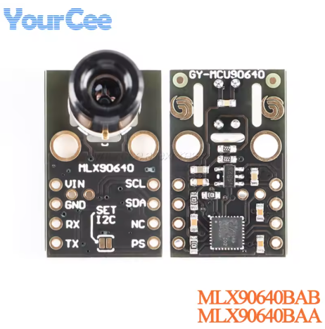
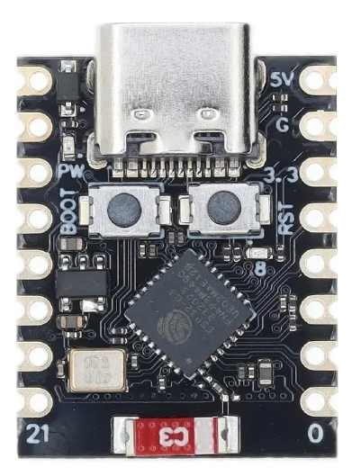

# 🔥 Câmera Térmica MLX90640 com ESP32-C3

Sistema embarcado em **MicroPython** para aquisição de imagens térmicas usando o sensor **MLX90640** (modulo GY-MCU90640) e transmissão automática via **HTTP POST** para um servidor remoto.

---

## ⚙️ Descrição Geral

O firmware roda em uma **placa ESP32-C3 SuperMini** conectada ao módulo **MLX90640BAB/BAA**, capturando quadros térmicos (24×32 pixels) pela UART e enviando periodicamente os dados em JSON para um endpoint HTTP configurável.

O sistema inclui:
- 🧠 Extração robusta de frames via UART  
- 🌡️ Conversão binária → temperatura (°C)  
- 🌐 Conexão Wi-Fi com sinalização visual por LED  
- 🔄 Upload periódico de imagens térmicas em JSON  
- 💡 Feedback visual em diferentes estados (conectando, enviado, erro)  

---

## 🧩 Hardware Utilizado

| Componente | Função | Interface |
|-------------|---------|-----------|
| **MLX90640BAB/BAA** | Câmera térmica 24×32 px | UART |
| **ESP32-C3 SuperMini** | Microcontrolador principal | USB-C, Wi-Fi, GPIO |
| **LED GPIO 8** | Indicador de status | Digital |
| **UART TX/RX (5/4)** | Comunicação com MLX90640 | UART1 |

### Conexões

| MLX90640 | ESP32-C3 |
|-----------|----------|
| VIN | 5V |
| GND | G |
| RX | GPIO 5 |
| TX | GPIO 4 |

---

## 🧠 Arquitetura de Software

```
main.py
├── Configuração Wi-Fi e LED
├── Leitura UART e reconstrução de frames (0x5A5A)
├── Decodificação e conversão para °C
├── Montagem de JSON (768 valores + timestamp)
├── Envio HTTP POST periódico
└── Loop principal com reconexão automática
```

---

## ⚙️ Configuração

Editar no início de `main.py`:

```python
WIFI_SSID = "sua_rede"
WIFI_PASS = "sua_senha"

URL_POST = "http://seu-servidor:porta/endpoint"
INTERVALO_ENVIO_S = 90  # intervalo entre uploads (segundos)
```

---

## 🚀 Execução

1. Copiar `main.py` para a placa ESP32-C3 (via Thonny, ampy ou rshell).  
2. Conectar o MLX90640 conforme o diagrama.  
3. Reiniciar a placa.

Durante o funcionamento:
- 🔴 LED piscando rápido → conectando ao Wi-Fi  
- 🟢 LED piscando lento → conectado  
- ✅ Piscada única → envio HTTP 200 OK  
- 🌐 Duas piscadas → reconexão de internet  

---

## 🧾 Estrutura de Dados Enviada

Cada envio HTTP POST contém um JSON no formato:

```json
{
  "temperaturas": [23.45, 23.60, ..., 26.12],
  "timestamp": 1730269802
}
```

- 768 valores de temperatura (float °C, resolução 0.01 °C)  
- Timestamp Unix (`time.time()` do ESP32)  

---

## 📦 Dependências (MicroPython)

- `urequests`
- `uselect`
- `struct`
- `network`
- `machine`
- `gc`
- `time`

---

## 🖼️ Hardware de Referência

| Sensor MLX90640 | ESP32-C3 SuperMini |
|-----------------|-------------------|
|  |  |

---

## 🔋 Requisitos e Considerações

- Firmware MicroPython v1.22+  
- UART configurada a **115200 bps**  
- Tensão de alimentação 5 V para o sensor  
- Cada frame contém 768 pixels (24×32)  
- O código ignora frames inválidos ou fora de faixa (-40 °C → 200 °C)  

---

## 🧪 Próximos Passos

- Armazenamento local em SDCard  
- Visualização térmica no Raspberry Pi (Flask + Matplotlib)  
- Treinamento de modelos de IA para detecção de eventos térmicos  

---

## 📄 Licença

Licença **MIT**  
Desenvolvido por **Prof. Marcelino Monteiro de Andrade**  
**Universidade de Brasília (FCTE/UnB)**  
[https://github.com/marcelinoandrade/greense](https://github.com/marcelinoandrade/greense)

---
