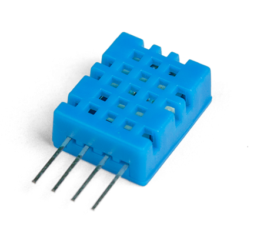
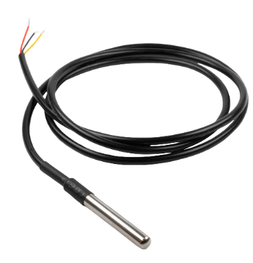
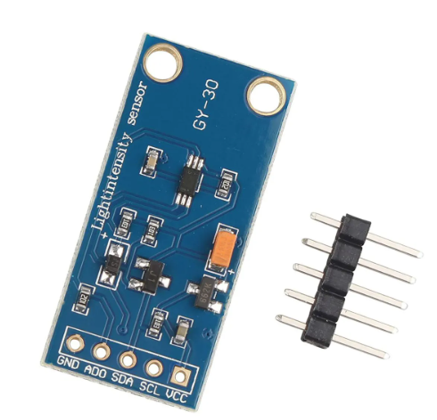
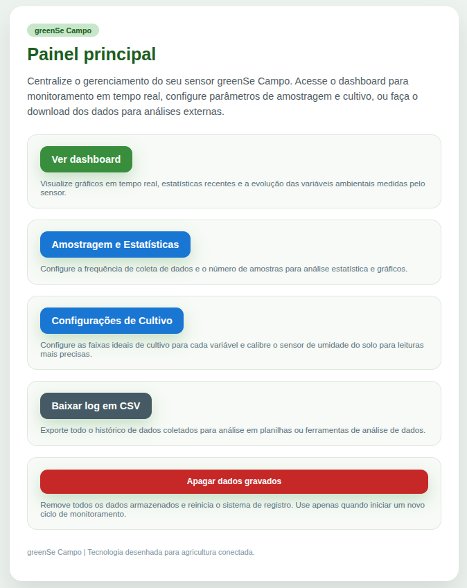
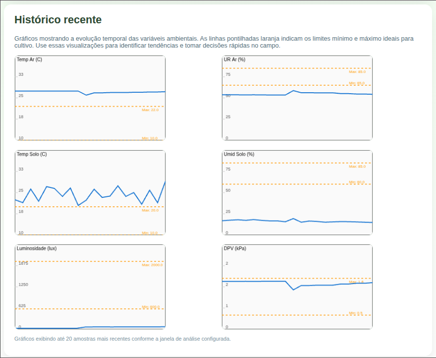
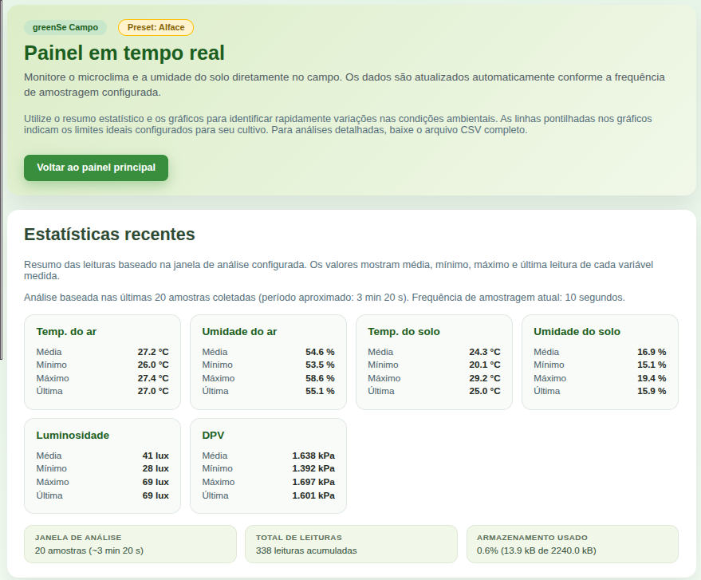

# 🌱 GreenSe – Módulo de Solo IoT (ESP32)

Firmware para um **módulo único** com ESP32, sensor capacitivo de umidade de solo (ADC), DHT11 para ar e luminosidade via BH1750. Interface web embarcada, armazenamento local em CSV e operação totalmente offline (AP próprio).

<div align="center">
  
</div>

## 🚀 Destaques
- Wi-Fi AP próprio (`greenSe_Campo` / senha `12345678`) e mDNS `greense.local`
- Dashboard web embarcado com gráficos, estatísticas e download de CSV
- Calibração de umidade do solo (seco/molhado) e tolerâncias configuráveis
- Operação resiliente: mantém último valor válido quando um sensor está ausente
- Log em SPIFFS com janela estatística configurável (médias/min/max)

## 🧭 Topologia de Sensores e GPIOs
| Função | Sensor / Interface | GPIO / Canal |
|--------|--------------------|--------------|
| Umidade do solo (raw) | ADC1 | GPIO32 (ADC_CHANNEL_4) |
| Temperatura do solo | DS18B20 (OneWire) | GPIO4 |
| Temp/Umid do ar | DHT11 (1-wire) | GPIO22 |
| Luminosidade | BH1750 (I2C) | SDA: GPIO21, SCL: GPIO19 |
| LED de status | GPIO digital | GPIO2 |

<div align="center">
  
  
  
</div>

> Pinagem reflete o firmware atual. Se usar outro layout, ajuste em `main/bsp/board.h`.

## 🌐 Acesso e Operação
- Conecte-se à rede **greenSe_Campo** (senha: `12345678`)
- Acesse `http://greense.local/` ou `http://192.168.4.1/`
- Amostragem padrão: 10 s (configurável via dashboard)
- CSV em `/spiffs/log_temp.csv`; disponível para download pela GUI

## 🖥️ Telas da Interface Web
<div align="center">
  
  
  
</div>

## 🔌 Ligações Rápidas
- **DHT11:** VCC 3V3, GND, DATA no GPIO22 (com resistor de pull-up interno via firmware)
- **Solo (capacit.)**: VCC 3V3, GND, saída analógica no GPIO32
- **DS18B20:** VCC 3V3, GND, DATA no GPIO4 com pull-up 4.7 kΩ
- **BH1750:** SDA 21, SCL 19, VCC 3V3, GND (pull-ups geralmente no módulo)
- **LED Status:** Anodo no GPIO2 (via resistor), catodo no GND

## 🗂️ Estrutura do Projeto
```
main/
├── CMakeLists.txt           # Fontes do componente
├── app/                     # Lógica de aplicação (log, GUI, tolerâncias, etc.)
├── bsp/                     # Board Support Package (pinos e drivers)
│   ├── board.h              # Definições de GPIO/ADC/I2C
│   ├── sensors/             # Drivers DHT11, BH1750, DS18B20, ADC solo
│   └── actuators/           # LED de status
└── gui/web/                 # Servidor HTTP e páginas
```

## 📊 Formato de Dados (CSV)
Cabeçalho:
```
N,temp_ar_C,umid_ar_pct,temp_solo_C,umid_solo_pct,luminosidade_lux,dpv_kPa
```
Exemplo:
```
1,25.3,65.2,22.1,45.8,850.5,1.234
```

## 🛠️ Build e Flash (ESP-IDF ≥ v5)
```bash
idf.py set-target esp32
idf.py build flash monitor
```

## 🩺 Troubleshooting rápido
- **Leituras NAN:** sensor ausente ou falha momentânea; o sistema usa último valor válido.
- **DHT11 instável:** garanta intervalo ≥2 s entre leituras (o firmware já respeita).
- **BH1750 sem resposta:** confira SDA/SCL (21/19), pull-ups e VCC 3V3.
- **Solo ADC ruidoso:** cabo curto, GND comum e fonte estável ajudam; faça calibração via GUI.

## 📜 Autoria
Projeto GreenSe – Agricultura Inteligente  
Coordenação: Prof. Marcelino Monteiro de Andrade & Prof. Ronne Toledo  
FCTE – Universidade de Brasília · 🌐 https://greense.com.br · ✉️ andrade@unb.br
