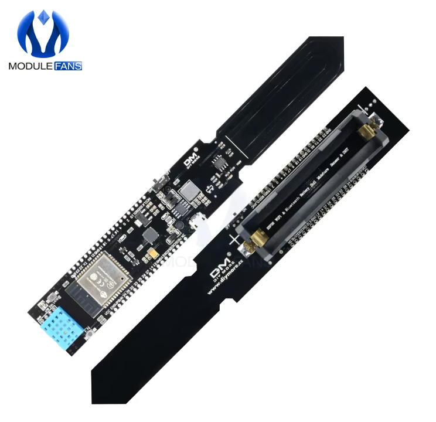

# N06-C2 · Módulo de Solo IoT · Sensor de Campo Compacto (ESP32)

Firmware para **módulo único** com ESP32, sensor capacitivo de umidade de solo (ADC), DHT11 para ar e luminosidade via BH1750. Interface web embarcada, armazenamento local em CSV e operação totalmente offline (AP próprio).

<div align="center">
  
</div>

---

## Descrição Geral

Módulo compacto de solo totalmente offline com AP `greenSe_Campo`, dashboard interativo e log em SPIFFS. Sistema com presets pré-configurados e suporte a upload de presets personalizados via arquivo JSON.

### Destaques

- Wi-Fi AP próprio (`greenSe_Campo` / senha `12345678`) e mDNS `greense.local`
- Dashboard web embarcado com gráficos, estatísticas e download de CSV
- Calibração de umidade do solo (seco/molhado) e tolerâncias configuráveis
- **Upload de presets personalizados**: Compartilhe configurações de cultivo entre cultivadores via arquivo JSON
- Operação resiliente: mantém último valor válido quando um sensor está ausente
- Log em SPIFFS com janela estatística configurável (médias/min/max)
- **Validação inteligente de sensores**: Detecção adaptativa de outliers baseada no período de amostragem
- **DHT11 robusto**: Sistema de retry automático com validação de valores e tratamento de erros

---

## Topologia de Sensores e GPIOs

| Função | Sensor / Interface | GPIO / Canal |
|--------|--------------------|--------------|
| Umidade do solo (raw) | ADC1 | GPIO32 (ADC_CHANNEL_4) |
| Temperatura do solo | DS18B20 (OneWire) | GPIO4 |
| Temp/Umid do ar | DHT11 (1-wire) | GPIO22 |
| Luminosidade | BH1750 (I2C) | SDA: GPIO21, SCL: GPIO19 |
| LED de status | GPIO digital | GPIO16 |

> Pinagem reflete o firmware atual. Se usar outro layout, ajuste em `main/bsp/board.h`.

---

## Acesso e Operação

- Conecte-se à rede **greenSe_Campo** (senha: `12345678`)
- Acesse `http://greense.local/` ou `http://192.168.4.1/`
- Amostragem padrão: 10 s (configurável via dashboard)
- CSV em `/spiffs/log_temp.csv`; disponível para download pela GUI

---

## Interface Web

A interface web oferece:
- **Monitoramento**: Dashboard principal com gráficos em tempo real, estatísticas das últimas medidas e alertas visuais quando valores estão fora dos limites configurados
- **Configuração**: Ajustes de período de amostragem, tolerâncias de cultivo, calibração de umidade do solo e visualização de estatísticas históricas
- **Presets de Cultivo**: Sistema com presets pré-configurados (Tomate, Morango, Alface, Rúcula) e suporte a upload de presets personalizados via arquivo JSON

---

## Ligações Rápidas

- **DHT11**: VCC 3V3, GND, DATA no GPIO22 (com resistor de pull-up interno via firmware)
- **Solo (capacit.)**: VCC 3V3, GND, saída analógica no GPIO32
- **DS18B20**: VCC 3V3, GND, DATA no GPIO4 com pull-up 4.7 kΩ
- **BH1750**: SDA 21, SCL 19, VCC 3V3, GND (pull-ups geralmente no módulo)
- **LED Status**: Anodo no GPIO16 (via resistor), catodo no GND

---

## Estrutura do Projeto

```
main/
├── CMakeLists.txt           # Fontes do componente
├── app/                     # Lógica de aplicação (log, GUI, tolerâncias, etc.)
├── bsp/                     # Board Support Package (pinos e drivers)
│   ├── board.h              # Definições de GPIO/ADC/I2C
│   ├── sensors/             # Drivers DHT11, BH1750, DS18B20, ADC solo
│   └── actuators/           # LED de status
└── gui/web/                 # Servidor HTTP e páginas
```

---

## Formato de Dados (CSV)

Cabeçalho:
```
N,temp_ar_C,umid_ar_pct,temp_solo_C,umid_solo_pct,luminosidade_lux,dpv_kPa
```

Exemplo:
```
1,25.3,65.2,22.1,45.8,850.5,1.234
```

---

## Build e Flash

```bash
idf.py set-target esp32
idf.py build flash monitor
```

---

## Presets de Cultivo e Compartilhamento

O sistema inclui presets pré-configurados para cultivos comuns (Tomate, Morango, Alface, Rúcula) e permite **upload de presets personalizados** via arquivo JSON. Esta funcionalidade facilita a **troca de experiência entre cultivadores**, permitindo que:

- ✅ Cultivadores experientes compartilhem configurações testadas e otimizadas
- ✅ Novos cultivadores utilizem presets validados por outros usuários
- ✅ Comunidades agrícolas criem bibliotecas de presets para diferentes variedades e condições
- ✅ Pesquisadores compartilhem configurações baseadas em estudos científicos

### Como usar:

1. Acesse a página **Cultivo** (`/calibra`)
2. Use o arquivo `presets_exemplo.json` como base
3. Personalize os valores de temperatura, umidade, luminosidade e DPV
4. Faça upload do arquivo JSON na interface web
5. Os presets estarão disponíveis imediatamente no dropdown

Para mais detalhes, consulte `PRESETS_UPLOAD_README.md`.

---

## Validação e Robustez de Sensores

O sistema implementa várias camadas de validação para garantir dados confiáveis:

### Validação Básica

- Verifica ranges válidos para todos os sensores (temperatura, umidade, luminosidade)
- Rejeita valores NaN (Not a Number) e fora dos limites físicos dos sensores
- Valida consistência entre sensores relacionados (ex: temperatura ar vs solo)

### Detecção Adaptativa de Outliers

- **Períodos curtos (< 1 min)**: Limites restritivos (5°C, 10%) para detectar erros imediatos
- **Períodos médios (1 min - 1 h)**: Limites escalonados proporcionalmente ao tempo
- **Períodos longos (6-12 h)**: Limites permissivos (até 50°C, 100%) para permitir variações naturais dia/noite

O sistema adapta automaticamente os limites de detecção de outliers baseado no período de amostragem configurado.

### DHT11 Aprimorado

- **Retry automático**: Até 3 tentativas com backoff exponencial (50ms, 100ms, 200ms)
- **Validação de valores**: Verifica se temperatura (-40°C a +80°C) e umidade (0-100%) estão dentro dos ranges válidos
- **Intervalo mínimo**: Garante pelo menos 2.1 segundos entre leituras bem-sucedidas
- **Timeouts aumentados**: Mais tolerante a variações de timing e interferências
- **Preparação do pino**: Reinicializa o pino corretamente antes de cada tentativa

---

## Troubleshooting

- **Leituras NAN**: Sensor ausente ou falha momentânea; o sistema usa último valor válido
- **DHT11 instável**: O firmware implementa retry automático e validação; garanta intervalo ≥2 s entre leituras (já respeitado automaticamente)
- **Valores rejeitados como outliers**: Em períodos longos (6-12h), variações grandes são esperadas; o sistema adapta os limites automaticamente
- **BH1750 sem resposta**: Confira SDA/SCL (21/19), pull-ups e VCC 3V3
- **Solo ADC ruidoso**: Cabo curto, GND comum e fonte estável ajudam; faça calibração via GUI

---

## Licença

Este projeto faz parte do Projeto GreenSe da Universidade de Brasília.

**Autoria**: Prof. Marcelino Monteiro de Andrade  
**Instituição**: Faculdade de Ciências e Tecnologias em Engenharia (FCTE) – Universidade de Brasília  
**Website**: [https://greense.com.br](https://greense.com.br)  
**Email**: [andrade@unb.br](mailto:andrade@unb.br)
