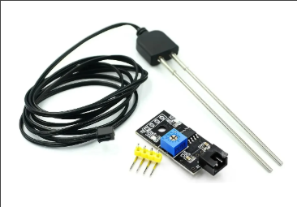
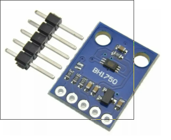

# 🌱 Projeto GreenSe – Sensor de Campo IoT (ESP32)

Sistema embarcado desenvolvido com **ESP-IDF (v5.x)** para monitoramento ambiental e de solo, integrando sensores de temperatura, umidade e armazenamento local, com interface web embarcada em servidor HTTP.  

## ⚙️ Visão Geral

O projeto implementa um nó de coleta de dados ambientais e de solo para aplicações de **agricultura inteligente**.  

O firmware cria uma rede **Wi-Fi Access Point (AP)** local e hospeda uma página interativa acessível via navegador (`http://192.168.4.1/`), permitindo visualizar gráficos, calibrar sensores e baixar o histórico de medições em CSV.

### Funcionalidades principais

- 📡 Cria uma rede Wi-Fi local “ESP32_TEMP” com IP fixo `192.168.4.1`.
- 🌤️ Lê sensores de:
  - **Temperatura do solo** (DS18B20) ✅ *Implementado*
  - **Umidade do solo** (sensor resistivo/capacitivo via ADC) ✅ *Implementado*
  - **Temperatura e umidade do ar** (AHT10 via I2C) 🔄 *Hardware futuro - atualmente simulado*
  - **Luminosidade** (BH1750 GY-30 via I2C) 🔄 *Hardware futuro - atualmente simulado*
  - **Déficit de Pressão de Vapor (DPV)** (calculado a partir de temperatura e umidade do ar) ✅ *Implementado*
- 💾 Armazena leituras em `log_temp.csv` no **SPIFFS** e expõe JSON com histórico (inclui luminosidade e DPV).
- 📈 Exibe **dashboard responsivo** com gráficos e cards de status em tempo real para todos os sensores.
- 🔁 Permite ajustar o **período de amostragem** (1 s, 1 min, 10 min, 1 h, 6 h, 12 h) diretamente na interface web.
- ⚙️ Possui **calibração guiada** da umidade do solo (parâmetros “seco” e “molhado”).
- ⬇️ Oferece **download direto** do log em CSV e limpeza total dos dados.
- 🧠 Quando algum sensor está ausente, gera dados simulados para manter o dashboard ativo.
- 🔧 Possui servidor HTTP leve com rotas dedicadas.
- 💡 Sistema de **LED de status** que indica estado do AP e gravação de dados.

---

## 🧩 Estrutura de Diretórios

```
main/
├── app/
│   ├── app_main.c             # Inicialização, tarefas FreeRTOS e laço principal
│   ├── app_data_logger.c/.h   # Registro em SPIFFS e geração de JSON/CSV (inclui luminosidade e DPV)
│   ├── app_sensor_manager.c/.h# Integração com BSP dos sensores
│   ├── app_sampling_period.c/.h # Configuração dinâmica do período de amostragem (NVS)
│   ├── app_atuadores.c/.h     # Controle de LED de status e feedback visual
│   └── gui_services.c/.h      # Ponte entre camada APP e GUI
├── bsp/
│   ├── board.h                # Definições da placa (GPIOs, SPIFFS, intervalos)
│   ├── sensors/               # Drivers DS18B20, ADC e camada `bsp_sensors.c`
│   │   ├── bsp_sensors.c/.h   # Interface abstrata de sensores
│   │   ├── bsp_ds18b20.c/.h   # Driver DS18B20 (OneWire)
│   │   └── bsp_adc.c/.h       # Driver ADC para umidade do solo
│   └── network/               # SoftAP (`bsp_wifi_ap`)
├── gui/
│   └── web/
│       ├── gui_http_server.c  # Servidor HTTP e páginas HTML inline
│       └── gui_http_server.h
├── imagens/                   # Imagens dos hardwares utilizados
│   ├── esp32_battery.png
│   ├── sensorDs18b20.png
│   ├── sensorumidade.png
│   ├── sensorAHT10.png
│   └── sensorBH1750.png
├── CMakeLists.txt             # Registro de fontes no componente `main`
└── README.md                  # Este arquivo
```

---

## 🖼️ Hardware Utilizado

### Placa Principal

| ESP32 com Bateria |
|-------------------|
|  |
| **Status:** ✅ *Em uso* |
| Placa ESP32-WROOM-32 com módulo de bateria para operação autônoma em campo. |

### Sensores Implementados (Atuais)

| DS18B20 - Sensor de Temperatura do Solo |
|------------------------------------------|
|  |
| **Status:** ✅ *Implementado e funcionando* |
| Sensor digital de temperatura do solo com interface OneWire. Precisão de ±0.5°C no range de -10°C a +85°C. |

| Sensor de Umidade do Solo |
|---------------------------|
|  |
| **Status:** ✅ *Implementado e funcionando* |
| Sensor resistivo/capacitivo de umidade do solo conectado via ADC (GPIO34). Requer calibração para valores "seco" e "molhado". |

### Sensores Futuros (Hardware a ser integrado)

| AHT10 - Sensor de Temperatura e Umidade do Ar |
|------------------------------------------------|
|  |
| **Status:** 🔄 *Hardware futuro - código preparado, atualmente usando dados simulados* |
| Sensor I2C de temperatura e umidade do ar com alta precisão. Interface I2C (SDA: GPIO21, SCL: GPIO22). |

| BH1750 GY-30 - Luxímetro |
|--------------------------|
|  |
| **Status:** 🔄 *Hardware futuro - código preparado, atualmente usando dados simulados* |
| Sensor de luminosidade digital via I2C. Range de medição: 1-65535 lux. Interface I2C (SDA: GPIO21, SCL: GPIO22). |


## 🌐 Servidor Web Integrado

### Rotas HTTP

| Rota           | Método | Descrição |
|----------------|--------|-----------|
| `/`            | GET    | Painel principal (ação rápidas, branding greenSe Campo) |
| `/dashboard`   | GET    | Dashboard com cards, gráficos e leituras instantâneas |
| `/history`     | GET    | JSON com as últimas amostras para alimentar o dashboard |
| `/sampling`    | GET    | Página para escolher o período de amostragem (1 s até 12 h) |
| `/set_sampling`| GET    | Aplica o período selecionado (persistido em NVS) |
| `/calibra`     | GET    | Calibração guiada da umidade do solo |
| `/set_calibra` | GET    | Salva novos valores “seco/molhado” |
| `/download`    | GET    | Baixa `log_temp.csv` completo |
| `/clear_data`  | POST   | Limpa o log + calibração diretamente no dispositivo |
| `/favicon.ico` | GET    | Ícone da página (1×1 PNG) |

### Experiência da Interface Web

- **Painel principal**: cartão único com tag “greenSe Campo”, textos explicativos e botões para dashboard, amostragem, calibração, download e limpeza.
- **Dashboard**: hero com resumo das leituras, tabela textual e gráficos personalizados desenhados via canvas para todos os sensores (temperatura do ar, umidade do ar, temperatura do solo, umidade do solo, luminosidade e DPV).
- **Período de amostragem**: formulário com múltipla escolha (1 s → 12 h), descrições de impacto e botões responsivos.
- **Calibração**: cards destacando leitura bruta e faixa atual, inputs com labels claros, dica prática e botão verde padrão para retorno ao painel.

---

## 📊 Estrutura do Arquivo CSV

Local: `/spiffs/log_temp.csv`

O arquivo CSV armazena todas as leituras dos sensores com timestamp implícito (índice sequencial). Cada linha representa uma amostra coletada no período configurado.

| Campo | Descrição | Unidade | Sensor |
|--------|------------|---------|--------|
| N | Índice sequencial | — | — |
| temp_ar_C | Temperatura do ar | °C | AHT10 🔄 *Futuro* |
| umid_ar_pct | Umidade relativa do ar | % | AHT10 🔄 *Futuro* |
| temp_solo_C | Temperatura do solo | °C | DS18B20 ✅ |
| umid_solo_pct | Umidade do solo calibrada | % | Sensor ADC ✅ |
| luminosidade_lux | Intensidade luminosa | lux | BH1750 🔄 *Futuro* |
| dpv_kPa | Déficit de Pressão de Vapor | kPa | Calculado ✅ |

**Formato do cabeçalho CSV:**
```
N,temp_ar_C,umid_ar_pct,temp_solo_C,umid_solo_pct,luminosidade_lux,dpv_kPa
```

**Exemplo de linha:**
```
1,25.30,65.20,22.15,45.80,850.50,1.234
```

---

## 💾 Requisitos de Build

### Ferramentas

- ESP-IDF ≥ **v5.0**
- Python 3.x
- Ferramentas padrão (`idf.py`, `esptool.py`)

### Componentes ESP-IDF utilizados

- `esp_wifi`, `esp_netif`, `esp_http_server`
- `esp_event`, `lwip`
- `esp_adc`, `nvs_flash`, `spiffs`, `driver`
- `freertos`, `esp_rom`, `vfs`

---

## 🚀 Como Executar

1. Clone este repositório e configure o ambiente ESP-IDF:
   ```bash
   idf.py set-target esp32
   idf.py menuconfig
   ```
2. Compile e grave na placa:
   ```bash
   idf.py build flash monitor
   ```
3. Conecte-se ao Wi-Fi **ESP32_TEMP** (senha: `12345678`).
4. Acesse **http://192.168.4.1/** no navegador.

---

## 🧪 Testes de Campo

- Testado em ESP32-WROOM-32 e ESP32-S3.
- Funcionamento validado em:
  - **Chrome** (Android e Desktop)
  - **Edge** (Desktop)
  - **Samsung Browser** — com restrições de cabeçalhos HTTP (erro 431 sem impacto funcional).

---

## 🧰 Extensões futuras

### Hardware
- ✅ Integração física do **AHT10** (temperatura e umidade do ar) - código já preparado
- ✅ Integração física do **BH1750 GY-30** (luxímetro) - código já preparado

### Software
- Envio MQTT para servidor remoto.
- Dashboard remoto via Flask/InfluxDB.
- Integração com AI (modelo embarcado de previsão de irrigação).
- Modo STA (conexão em rede existente).
- Suporte a OTA update.
- Expansão do histórico JSON para incluir séries de luminosidade e DPV.

---

## 🧑‍🔬 Autoria e Créditos

**Projeto GreenSe | Agricultura Inteligente**  
Coordenação: *Prof. Marcelino Monteiro de Andrade* e *Prof. Ronne Toledo*  
Faculdade de Ciências e Tecnologias em Engenharia (FCTE) – Universidade de Brasília  
📧 [andrade@unb.br](mailto:andrade@unb.br)  
🌐 [https://greense.com.br](https://greense.com.br)
