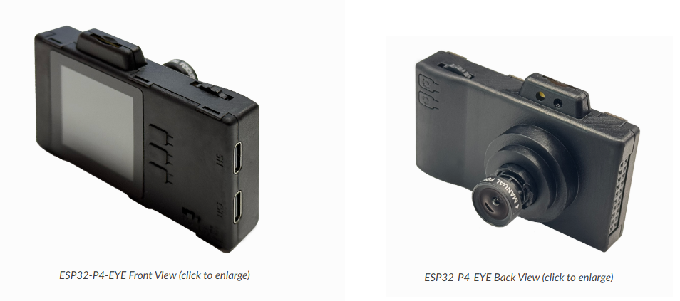

# N08 · Câmera P4 · Sistema de Coleta de Imagens (ESP32-P4-EYE)

Sistema de coleta de imagens baseado na placa **ESP32-P4-EYE**, otimizado para **ambientes agrícolas e campos abertos**, com detecção por IA (YOLOv11), captura intervalada e armazenamento em SD card.



---

## Descrição Geral

O **Greense** é um sistema de coleta de imagens baseado na placa ESP32-P4-EYE, especialmente otimizado para uso em **ambientes agrícolas e campos abertos**. O sistema oferece captura de fotos, captura intervalada, gravação de vídeo, visualização de álbum e configurações avançadas de parâmetros de imagem, todos configurados para operar em condições de luz natural e céu aberto.

### Recursos Principais

- Configurações otimizadas para campo aberto (parâmetros pré-configurados para iluminação solar natural)
- Captura de imagens em alta resolução (até 1080P) para análise agrícola
- Captura intervalada para monitoramento automático de culturas
- Gravação de vídeo em formato MP4
- Detecção por IA usando modelos YOLOv11 para identificação de pragas e doenças
- Armazenamento em SD Card para imagens e vídeos
- Acesso USB para transferência de dados
- Upload de imagens para servidor via POST `/upload` (fotos da pasta `imagens/` do SD card)

## Requisitos

### Hardware

* Placa de desenvolvimento ESP32-P4-EYE
* Cabo USB-C para alimentação e programação
* Cartão SD para armazenamento de fotos e vídeos (recomendado)

### Software

Este projeto suporta a seguinte versão do ESP-IDF:

- ESP-IDF release/v5.5 e todas as versões de correção

Consulte o [Guia de Programação ESP-IDF](https://docs.espressif.com/projects/esp-idf/en/latest/esp32p4/get-started/index.html) para configurar o ambiente de desenvolvimento. É **fortemente recomendado** passar pelo tutorial [Build Your First Project](https://docs.espressif.com/projects/esp-idf/en/latest/esp32p4/get-started/index.html#id8) para se familiarizar com o ESP-IDF e garantir que o ambiente está configurado corretamente.

## Configuração do Ambiente

### 1. Obter o Repositório

Antes de compilar, certifique-se de ter acesso ao repositório `esp-dev-kits` e seus componentes:

```bash
# Se necessário, clone o repositório esp-dev-kits
git clone --recursive https://github.com/espressif/esp-dev-kits.git
```

### 2. Configurar o Projeto

Execute ``idf.py menuconfig`` e modifique a configuração do ``Board Support Package``:

```
menuconfig > Component config > Board Support Package
```

### 3. Aplicar Patches (Se Necessário)

* Quando o clock de pixel está configurado para 80MHz, a fonte de clock SPI padrão pode temporariamente falhar em atender aos requisitos de timing. Para resolver isso, siga estes passos para aplicar o arquivo de patch `0004-fix-spi-default-clock-source.patch`:

1. Vá para o diretório raiz do ESP-IDF e faça checkout da versão específica (o patch é projetado para IDF release/v5.5 commit:98cd765953dfe0e7bb1c5df8367e1b54bd966cce):

```bash
cd ~/esp-idf
git checkout release/v5.5
git checkout 98cd765953dfe0e7bb1c5df8367e1b54bd966cce
```

2. Copie o arquivo de patch para o diretório raiz do ESP-IDF:

```bash
cp 0004-fix-spi-default-clock-source.patch ~/esp-idf/
```

3. Vá para o diretório raiz do ESP-IDF:

```bash
cd ~/esp-idf
```

4. Aplique o patch usando o seguinte comando:

```bash
git apply 0004-fix-spi-default-clock-source.patch
```

* Se você experimentar lag significativo durante a captura de fotos ou gravação de vídeo, pode tentar aplicar o arquivo de patch `0004-fix-sdmmc-aligned-write-buffer.patch` usando o mesmo método acima.

## Compilação e Instalação

Compile o projeto e faça o flash para a placa de desenvolvimento, depois execute a ferramenta monitor para visualizar a saída da porta serial (substitua `PORT` pelo nome da porta serial da sua placa):

```bash
idf.py -p PORT flash monitor
```

Pressione ``Ctrl-]`` para sair do monitor serial.

Para passos completos sobre como configurar e usar o ESP-IDF para compilar projetos, consulte o [Guia de Primeiros Passos do ESP-IDF](https://docs.espressif.com/projects/esp-idf/en/latest/esp32/get-started/index.html).

## Configurações de Câmera para Ambiente Agrícola

### Valores Padrão Otimizados para Campo Aberto

O sistema vem pré-configurado com valores ideais para operação em céu aberto:

| Parâmetro | Valor Padrão | Descrição |
|-----------|--------------|-----------|
| **Contraste** | 78% | Alto contraste para destacar detalhes e variações em campo aberto |
| **Saturação** | 52% | Reduzida para evitar oversaturação com iluminação solar intensa |
| **Brilho** | 62% | Aumentado para compensar variações de sombra e luz solar |
| **Matiz (Hue)** | 0% | Neutro - ideal para condições de luz natural variável |
| **Exposição** | 18% | ~1130μs (1/885s) - ideal para sol moderado em campo aberto |

### Resolução Recomendada

Para monitoramento agrícola e análise de imagens:

- **1080P (1920x1080)**: Recomendado para análise detalhada de culturas
- **720P (1280x720)**: Adequado para monitoramento geral
- **480P (640x480)**: Apenas para visualização rápida

### Funcionalidades Disponíveis

| Funcionalidade | Descrição |
|----------------|-----------|
| **Captura de Fotos** | Capture fotos pressionando o botão do encoder, com suporte para zoom digital através do encoder rotativo ou botões. <br> **Nota**: A captura de fotos requer um cartão SD. As fotos são salvas por padrão na pasta `esp32_p4_pic_save` no cartão SD. |
| **Captura Intervalada** | Configure o intervalo de captura usando os botões e inicie o modo de captura intervalada pressionando o botão do encoder. Útil para monitoramento contínuo de culturas. Pressione qualquer botão para parar a captura intervalada. |
| **Gravação de Vídeo** | Inicie a gravação de vídeo pressionando o botão do encoder. Os vídeos são salvos em formato MP4 na pasta `esp32_p4_mp4_save` no cartão SD. |
| **Álbum** | Visualize fotos capturadas e navegue por elas usando os botões. Pressione o botão do encoder para deletar a foto atual. Se a detecção YOLO estiver habilitada nas configurações, a detecção de objetos será executada automaticamente nas fotos ao navegar pelo álbum. |
| **Montagem USB** | Conecte o dispositivo a um PC via interface USB 2.0 para acessar diretamente os arquivos no cartão SD. |
| **Configurações** | Configure giroscópio, detecção YOLO, resolução de imagem, flash e ajuste saturação, contraste, brilho, matiz e tempo de exposição. |

## Casos de Uso em Agricultura

### Monitoramento de Culturas
- Captura intervalada para acompanhamento do crescimento
- Detecção de doenças e pragas usando IA
- Análise de cobertura vegetal

### Inspeção de Campos
- Documentação de condições do campo
- Registro de eventos e intervenções
- Análise de distribuição de plantas

### Pesquisa Agrícola
- Coleta de dados para estudos
- Comparação temporal de culturas
- Análise de eficiência de tratamentos

## Documentação Adicional

Para informações detalhadas sobre configurações avançadas da câmera, consulte:
- `CONFIGURACOES_CAMERA_ALVOS.md` - Guia completo de configurações para diferentes condições de iluminação

## Suporte Técnico

Para suporte técnico e feedback:

- Para questões técnicas, visite o fórum [esp32.com](https://esp32.com/viewforum.php?f=22)
- Para solicitações de funcionalidades ou relatórios de bugs, crie uma nova [issue no GitHub](https://github.com/espressif/esp-dev-kits/issues)

---

## Licença

Este projeto faz parte do Projeto GreenSe da Universidade de Brasília.

**Autoria**: Prof. Marcelino Monteiro de Andrade  
**Instituição**: Faculdade de Ciências e Tecnologias em Engenharia (FCTE) – Universidade de Brasília  
**Website**: [https://greense.com.br](https://greense.com.br)
