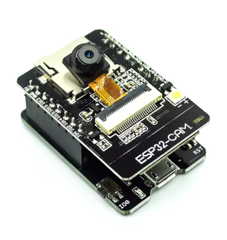
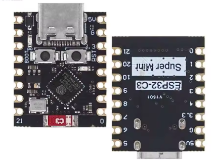
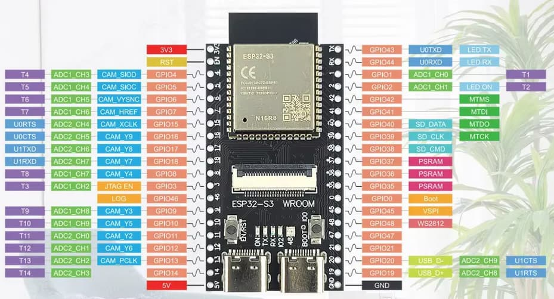
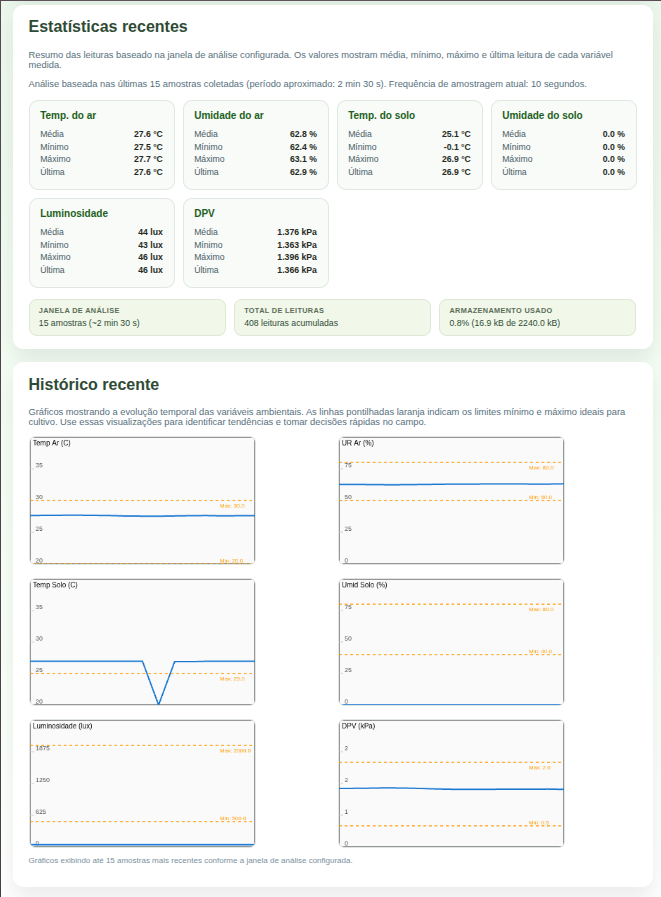
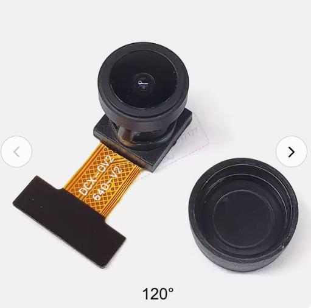

# 🌿 GreenSe | Catálogo de Nós e Aplicações

Todos os diretórios `Nxx_*` deste workspace representam clientes (ou versões de clientes) atendidos pelo Projeto GreenSe. Cada nó foi entregue com hardware específico, firmware pronto para campo e, quando disponível, imagens das placas utilizadas.

---

## 📊 Visão Geral

| Nó | Diretório | Stack / Linguagem | Hardware base | Comunicação | Imagens |
|----|-----------|-------------------|---------------|-------------|---------|
| N01 · Estufa Germinar | `N01_Estufa_Germinar_C` | ESP-IDF 5.x (C) com módulos `conexoes`, `sensores`, `atuadores` | ESP32 DevKit (Freenove) com sensores de clima e solo | Wi-Fi AP/STA, MQTT/TLS, HTTP local |  |
| N02 · Estufa Maturar | `N02_Estufa_Maturar_C` | ESP-IDF 5.x (C) | ESP32 DevKit com boias, sensor de luz e LED RGB | Wi-Fi STA, MQTT/TLS-WSS |  |
| N03 · Estufa MicroPython | `N03_Estufa_P` | MicroPython (classes Config/Conexao/SensorManager/ActuatorManager) | ESP32 com sensores AHT20, ENS160, pH/EC e boias | Wi-Fi STA + MQTT | _(imagem não disponível)_ |
| N04 · Estufa Câmera | `N04_Estufa_Camera_C` | ESP-IDF (C) com `esp32-camera` + SDMMC | ESP32-CAM (AI Thinker) | Wi-Fi STA, HTTPS POST, SD Card |  |
| N05 · Estufa Térmica (C) | `N05_Estufa_Termica_C` | ESP-IDF (C) com arquitetura BSP/APP/GUI | ESP32-C3 SuperMini + MLX90640 | Wi-Fi STA, HTTP JSON + NTP |   |
| N05 · Estufa Térmica MicroPython | `N05_Estufa_Termica_P` | MicroPython | ESP32-C3 SuperMini + MLX90640 | Wi-Fi STA, HTTP JSON |   |
| N06 · Sensor de Campo (C) | `N06_Sensor_Campo_C` | ESP-IDF (C) com servidor HTTP e SPIFFS | ESP32 Battery Kit (autônomo) | Wi-Fi AP (`ESP32_TEMP`), HTTP |  |
| N06 · Sensor de Campo MicroPython | `N06_Sensor_Campo_P` | MicroPython (libs, sensores e webserver) | ESP32 Battery Kit | Wi-Fi AP (`ESP32_TEMP`), HTTP |  |
| N07 · Estufa Artigo | `N07_Estufa_Artigo_C` | ESP-IDF (C) para ESP32-S3 com PSRAM, BSP/APP/GUI | ESP32-S3 WROOM + câmera visual + MLX90640 | Wi-Fi STA, HTTPS, NTP, SD, LED WS2812 |   |

---

## 🔍 Detalhamento por Nó

### N01 · Estufa Germinar — `N01_Estufa_Germinar_C`
- **Stack:** ESP-IDF 5.x com diretórios dedicados para conexões, sensores, atuadores e certificados TLS.
- **Sensores/Atuadores:** AHT20 ou DHT22 (ar), ENS160 (qualidade do ar), DS18B20 (solo) e relés genéricos.
- **Comunicação:** Wi-Fi em modo AP ou STA, MQTT seguro (`mqtt.greense.com.br:8883`) e servidor HTTP embarcado.
- **Aplicação:** Germinação controlada com logs em NVS/SPIFFS, interface web local e tópicos `greense/*`.
- **Imagem:** 
- **Documentação:** ver `N01_Estufa_Germinar_C/README.md`.

### N02 · Estufa Maturar — `N02_Estufa_Maturar_C`
- **Stack:** ESP-IDF (C) reutilizando a mesma arquitetura modular do N01.
- **Sensores/Atuadores:** Boias de nível, sensor de claridade, DS18B20 para reservatórios interno/externo, DHT22 externo, LED RGB (GPIO16).
- **Comunicação:** Wi-Fi STA com reconexão automática e MQTT seguro via TLS/WSS (JSON enviado a cada 5 s).
- **Aplicação:** Supervisão da fase de maturação com indicadores visuais e publicação contínua de dados ambientais.
- **Imagem:** 
- **Documentação:** `N02_Estufa_Maturar_C/README.md`.

### N03 · Estufa (MicroPython) — `N03_Estufa_P`
- **Stack:** MicroPython orientado a objetos (`Config`, `Conexao`, `SensorManager`, `ActuatorManager`).
- **Sensores/Atuadores:** AHT20, ENS160, sensores de pH/EC calibráveis, boias GPIO 32/33, bomba d'água e LED NeoPixel na GPIO16.
- **Comunicação:** Wi-Fi STA com watchdog via reconexão, MQTT configurável (broker em `config.py`).
- **Aplicação:** Nó completo para solução nutritiva com controle automático de bomba, leitura periódica e publicação de JSON.
- **Imagem:** _não há arquivo de imagem neste diretório._
- **Documentação:** código e comentários nos arquivos `main.py`, `conexao.py`, `sensores.py` e `atuadores.py`.

### N04 · Estufa Câmera — `N04_Estufa_Camera_C`
- **Stack:** ESP-IDF com componente `esp32-camera`, SDMMC, `esp_http_client` e TLS embutido.
- **Sensores/Atuadores:** Câmera OV2640 integrada, flash LED (GPIO4) e LED de status (GPIO33).
- **Comunicação:** Wi-Fi STA com reconexão, upload HTTPS das imagens e backup local no cartão SD.
- **Aplicação:** Captura periódica (XGA, JPEG), armazenamento em `/sdcard` e envio automático para endpoint configurável.
- **Imagem:** 
- **Documentação:** `N04_Estufa_Camera_C/README.md`.

### N05 · Estufa Térmica (C) — `N05_Estufa_Termica_C`
- **Stack:** ESP-IDF (C) organizado em camadas BSP/APP/GUI, com sincronização NTP e partição customizada.
- **Sensores/Atuadores:** MLX90640 (24×32) via UART, LED GPIO8 para status, conexões UART5/4 com o módulo térmico.
- **Comunicação:** Wi-Fi STA, HTTP POST em JSON para envio de frames, agendamentos baseados em horário real, NTP e retries com backoff.
- **Aplicação:** Termovisor com conversão binária→°C, agendamento configurável, logs detalhados e indicadores visuais.
- **Imagens:**   
- **Documentação:** ver `N05_Estufa_Termica_C/README.md`.

### N05 · Estufa Térmica (MicroPython) — `N05_Estufa_Termica_P`
- **Stack:** MicroPython com leitura UART dos frames 0x5A5A, parsing para floats e envio HTTP periódico.
- **Sensores/Atuadores:** MLX90640 via UART, LED GPIO8 para feedback e sinalização de eventos.
- **Comunicação:** Wi-Fi STA, HTTP POST em JSON com timestamp MicroPython.
- **Aplicação:** Variante leve do termovisor para deploy rápido (cópia de `main.py` para placa).
- **Imagens:**  
- **Documentação:** `N05_Estufa_Termica_P/README.md`.

### N06 · Sensor de Campo (C) — `N06_Sensor_Campo_C`
- **Stack:** ESP-IDF com servidor HTTP embarcado (`http_server.c`), SPIFFS e logger CSV.
- **Sensores/Atuadores:** Temperatura/umidade do ar, DS18B20 (solo), sensor resistivo/capacitivo de umidade do solo com calibração.
- **Comunicação:** Wi-Fi Access Point próprio (`ESP32_TEMP`), IP fixo `192.168.4.1`, dashboard com gráficos e download de logs CSV.
- **Aplicação:** Nó de campo autônomo com histórico em `log_temp.csv`, calibração remota e dashboard responsivo.
- **Imagens:**   
- **Documentação:** `N06_Sensor_Campo_C/README.md`.

### N06 · Sensor de Campo (MicroPython) — `N06_Sensor_Campo_P`
- **Stack:** MicroPython com módulos `sensores/`, `libs/` (logger) e `webserver/` (HTTP/AP).
- **Sensores/Atuadores:** DS18B20 no GPIO4, sensor de umidade do solo no ADC34, LED on-board para feedback.
- **Comunicação:** Cria AP `ESP32_TEMP`, responde rotas `/`, `/history`, `/download`, `/calibra`, `/set_calibra`.
- **Aplicação:** Logger simplificado que grava `log_temp.csv`, expõe gráficos em canvas e permite calibrar o sensor de solo via browser.
- **Imagem:** 
- **Documentação:** código principal em `main.py` e `webserver/http_server.py`.

### N07 · Estufa Artigo (Visual + Térmica) — `N07_Estufa_Artigo_C`
- **Stack:** ESP-IDF para ESP32-S3 com PSRAM habilitada, camadas BSP/APP/GUI, partição customizada e scripts auxiliares (`visualize_thermal.py`).
- **Sensores/Atuadores:** Câmera visual OV2640 integrada, MLX90640 (UART14), SD card, LED WS2812 (GPIO48) e flash GPIO21.
- **Comunicação:** Wi-Fi STA, HTTPS com certificados embutidos, envio imediato de dados térmicos, sincronização NTP e pipelines SPIFFS→SD para arquivamento.
- **Aplicação:** Plataforma premium combinando captura visual e térmica, com agendamentos independentes, watchdogs, checksums e integração com scripts Python.
- **Imagens:**   
- **Documentação:** `N07_Estufa_Artigo_C/README.md`, `README_THERMAL.md`, `ANALISE_CONFIABILIDADE.md`.

---

## ✅ Como aproveitar este catálogo
1. Use a tabela “Visão Geral” para identificar rapidamente o nó, diretório e tecnologia.
2. Consulte a subseção correspondente para revisar sensores, protocolos e artefatos relevantes.
3. Abra o README específico de cada pasta para instruções de build/flash, credenciais e detalhes de implantação.
4. Reaproveite as imagens citadas acima em relatórios e apresentações para cada cliente.
5. Ao criar novos nós (N08, N09, …) mantenha o mesmo padrão: pastas autoexplicativas, README local e referência no catálogo.
