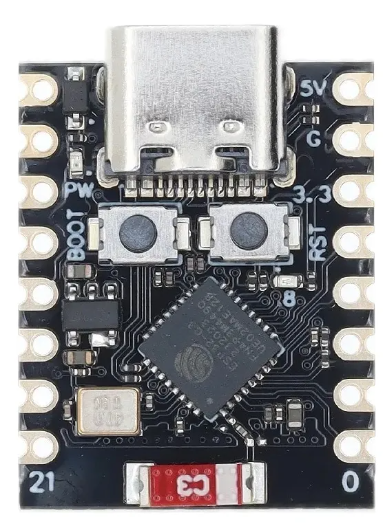

# 🌿 GreenSe | Catálogo de Clientes e Aplicações

Este repositório reúne os firmwares e scripts entregues a diferentes clientes do Projeto GreenSe. Cada pasta `Nxx_*` corresponde a um nó IoT completo com hardware específico, pilha de software definida e imagens de referência já organizadas nos próprios diretórios.

---

## Clientes e Tecnologias

### N01 · Estufa Germinar
- Diretório: `N01_Estufa_Germinar_C`
- Tecnologia: ESP-IDF (C) modular com componentes de conexões, sensores e atuadores
- Comunicação: Wi-Fi AP/STA, MQTT sobre TLS e servidor HTTP local
- Aplicação: Monitoramento e atuação na fase de germinação (sensores AHT20, ENS160, DS18B20/DHT22 e relés configuráveis)
- Imagem: 

---

### N02 · Estufa Maturar
- Diretório: `N02_Estufa_Maturar_C`
- Tecnologia: ESP-IDF (C) reaproveitando a arquitetura modular do N01
- Comunicação: Wi-Fi STA com reconexão automática e MQTT seguro (TLS/WSS)
- Aplicação: Supervisão da fase de maturação com boias de nível, sensor de luz, DS18B20 interno/externo, DHT22 externo e LED RGB de status
- Imagem: 

---

### N03 · Estufa (MicroPython)
- Diretório: `N03_Estufa_P`
- Tecnologia: MicroPython orientado a objetos (Config, Conexao, SensorManager e ActuatorManager)
- Comunicação: Wi-Fi STA + MQTT
- Aplicação: Nó híbrido com sensores AHT20, ENS160, pH e EC, boias de nível e atuadores (bomba e LED NeoPixel)
- Imagem: _(sem arquivo cadastrado neste diretório)_

---

### N04 · Estufa Câmera
- Diretório: `N04_Estufa_Camera_C`
- Tecnologia: ESP-IDF (C) com componente `esp32-camera`, SDMMC e `esp_http_client`
- Comunicação: Wi-Fi STA, envio HTTPS POST e armazenamento em cartão SD
- Aplicação: Captura periódica de imagens JPEG na ESP32-CAM (AI Thinker) com flash dedicado e LED de status
- Imagem: 

---

### N05 · Estufa Térmica (C)
- Diretório: `N05_Estufa_Termica_C`
- Tecnologia: ESP-IDF (C) no ESP32-C3 com camadas BSP/APP/GUI e sincronização NTP
- Comunicação: Wi-Fi STA, HTTP POST em JSON e verificações de conectividade
- Aplicação: Termovisor MLX90640 com agendamentos, LED de estados, reconexão Wi-Fi e histórico térmico
- Imagens:   

---

### N05 · Estufa Térmica (MicroPython)
- Diretório: `N05_Estufa_Termica_P`
- Tecnologia: MicroPython para ESP32-C3 com leitura UART direta do MLX90640
- Comunicação: Wi-Fi STA e HTTP POST periódico
- Aplicação: Versão ágil do termovisor com LED de status e configuração rápida no `main.py`
- Imagens:  

---

### N06 · Sensor de Campo (C)
- Diretório: `N06_Sensor_Campo_C`
- Tecnologia: ESP-IDF com servidor HTTP embarcado, SPIFFS e data logger CSV
- Comunicação: Wi-Fi Access Point dedicado (`ESP32_TEMP`) e dashboard local
- Aplicação: Coleta de temperatura/umidade do ar, temperatura do solo e umidade do solo com calibração e download de logs
- Imagem: 

---

### N06 · Sensor de Campo (MicroPython)
- Diretório: `N06_Sensor_Campo_P`
- Tecnologia: MicroPython com módulos `sensores/`, `libs/` e `webserver/`
- Comunicação: Wi-Fi AP `ESP32_TEMP` com servidor HTTP (dashboard, histórico e calibração)
- Aplicação: Logger simplificado que grava CSV, expõe gráficos e permite ajustar calibração do solo via navegador
- Imagem: 

---

### N07 · Estufa Artigo (Visual + Térmica)
- Diretório: `N07_Estufa_Artigo_C`
- Tecnologia: ESP-IDF (C) para ESP32-S3 com PSRAM, camadas BSP/APP/GUI, SD card e LED WS2812
- Comunicação: Wi-Fi STA, HTTPS para imagens visuais e JSON térmico, sincronização NTP e fluxo de arquivamento em SPIFFS/SD
- Aplicação: Plataforma premium com câmera visual integrada, MLX90640, scripts Python para visualização e pipelines de backup
- Imagens:  

---

## Como usar este catálogo
1. Localize o diretório do cliente desejado na lista acima.
2. Leia os bullets de tecnologia, comunicação e aplicação para entender rapidamente o escopo do nó.
3. Acesse o README específico dentro da pasta para instruções de build, flash ou implantação.
4. Utilize as imagens já linkadas para relatórios, apresentações ou documentação entregue aos clientes.
5. Sempre que surgir um novo cliente (N08, N09, …), replique este padrão adicionando a descrição e a imagem correspondente.
